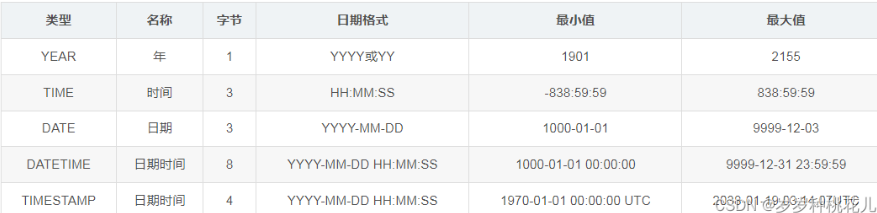
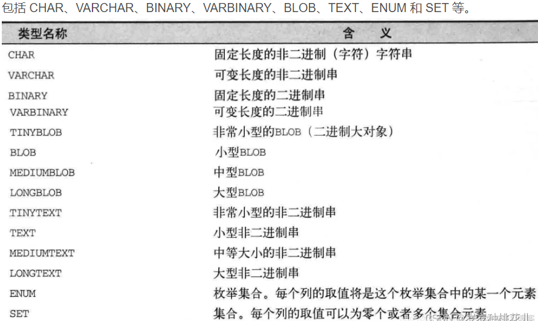
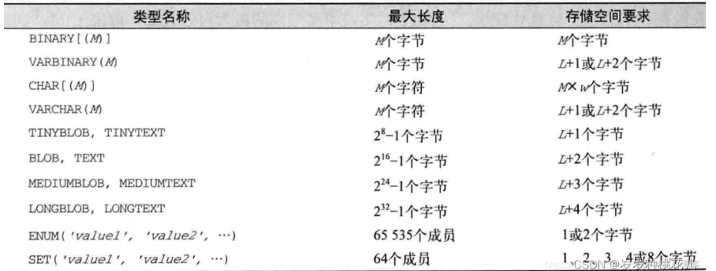
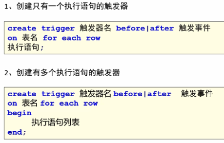
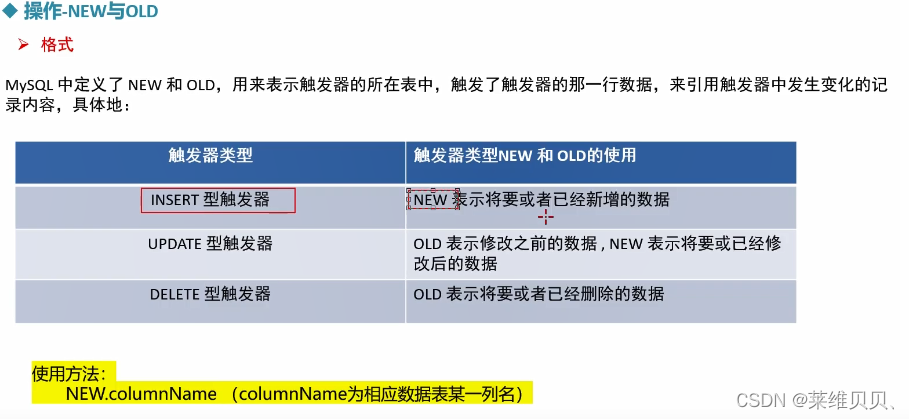
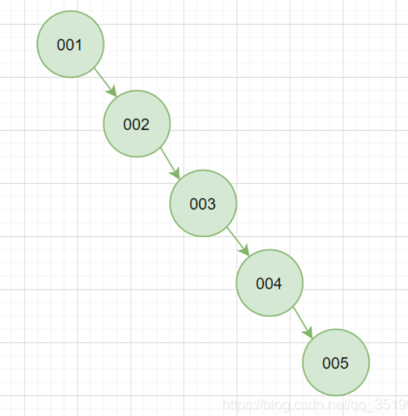
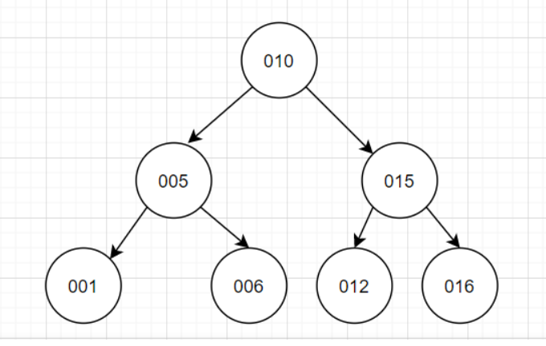
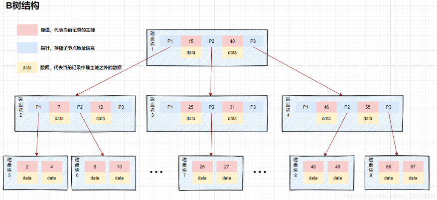

## 一、MySQL的版本、安装、配置、删除

#### 版本：

- 5.7.26
- 8.0.12

#### windows安装配置：

- 下载压缩包，解压到指定的目录
- 配置初始化文件my.ini
  - 配置端口
  - 设置安装目录
  - 设置mysql数据库的数据的存放目录
  - 最大连接数，字符集默认、默认存储引擎等
- 初始化MySQL，进入bin目录
  - 执行  musqld --initialize --console
  - 务必保存好root@localhost:之后的密码

- 安装mysql服务并启动+修改密码
  - 执行mysqld  --install  mysql  //安装mysql服务
  - net start mysql    //启动mysql服务
  - mysql  --uroot  -p    //输入刚刚保存的密码，登录数据库
  - ALTER　USER　’root‘@’localhost' IDENTIFIED BY '新的密码'     //修改密码
- 配置环境变量
  - 编辑系统变量
    - MYSQL_HOME：msql的安装路径
  - 在Path中添加
    - %MYSQL_HOME%
    - %MYSQL_HOME%bin

#### 删除：

删除之前要先关闭MySQL服务

执行  sc delete mysql

#### Linux安装

- 查看是否安装过MySQL

  - ```shell
    rpm -qa| grep mysql
    ```

- 下载官方MySQL包
  
- wget -i -c http://dev.mysql.com/get/mysql57-community-release-el7-10.noarch.rpm
  
- 安装MySQL包

  - yum -y install mysql57-community-release-el7-10.noarch.rpm

- 启动

  - ```shell
    # 启动
    systemctl start mysqld
    ​
    # 重启
    systemctl restart mysqld
    ​
    # 停止
    systemctl stop mysqld
    
    ```

    

#### 卸载

yum -y remove mysql-community-server

卸载 MySQL 前需要先停止 MySQL

关闭服务命令：systemctl stop mysqld

##### 卸载：rpm -e 文件名

## 二、创建库、用户、授权

#### 数据库实例

创建名称为“testdb”数据库，并设定编码集为utf8

```sql
CREATE DATABASE IF NOT EXISTS testdb DEFAULT CHARSET utf8mb4 COLLATE utf8mb4_general_ci;
```

#### 创建用户

```sql
 --创建了一个名为：test 密码为：1234 的用户
create user 'test'@'localhost' identified by '1234';

//修改密码
ALTER　USER　'root'@'localhost' IDENTIFIED BY '新的密码'    
//查询用户
select user,host form mysql.user;

//删除用户test
drop user test@localhost;

--若创建的用户允许任何电脑登陆，删除用户如下
drop user test@'%';

//更改密码
--方法1，密码实时更新；修改用户“test”的密码为“1122”
set password for test =password('1122');
--方法2，需要刷新；修改用户“test”的密码为“1234”
update  mysql.user set  password=password('1234')  where user='test'
--刷新
flush privileges;

```

注意：
此处的"localhost"，是指该用户只能在本地登录，不能在另外一台机器上远程登录。如果想远程登录的话，将"localhost"改为"%"，表示在任何一台电脑上都可以登录。也可以指定某台机器可以远程登录。

#### 分配权限

```sql
//授权全部权限
--全部权限==授予用户通过外网IP对于该数据库“testdb”的全部权限
grant all privileges on 'testdb'.* to 'test'@'%';
flush privileges;

//授权部分权限
--部分权限==授予用户“test”通过外网IP对于该数据库“testdb”中表的创建、修改、删除权限,以及表数据的增删查改权限
grant create,alter,drop,select,insert,update,delete on 'testdb'.* to 'test'@'%';
flush privileges;  

//查看用户权限
show grants for test;

注意：修改完权限以后，一定要刷新任务，或者重启服务，刷新服务用：
flush privileges；
```

## 三、表操作

#### 基本数据类型

##### 数值类型：

- 整数：TINYINT、SMALLINT、MEDIUMINT、INT、BIGINT

- 浮点数：包括FLOAT、DOUBLE

- 定点数类型为DECIMAL，其主要存储对精度要求比较高的数值，比如金额，decimal在mysql内存是以字符串二进制存储的。声明语法DECIMAL(M,D)。M是数字最大位数（精度precision）范围1-65；D是小数点右侧数字个数（标度scale），范围0-30，但不得超过M，即D<=M;

  定点数就是小数点额位置在计算机的存储是约定好的，固定的。一个小数的整数部分和小数部分分别转化为二进制的标识

##### 日期/时间类型:

YEAR、DATE、DATE、DATETIME和TIMESTAMP



1、YEAR：标识年份，从MySQL5.5.27开始，不推荐使用

2DATE：标识日期，没有时间部分，格式为YYYY-MM-DD。需要占用3个字节的存储空间。插入数据时，需要满足上面的格式

**使用CURRENT_DATE()或者NOW()函数，会插入当前系统的日期**

3、Time：表示时间，不包含日期。需要3个字节，格式HH：MM：SS来表示。

**使用CURRENT_TIME()或者NOW()，会插入当前系统的时间。**

4、DATETIME：在所有的日期时间类型中占用的存储空间最大，总共需要8个字节的存储空间。在格式上为DATE类型和TIME类型的结合

**使用函数CURRENT_TIMESTAMP()和NOW()，可以向DATETIME类型的字段插入系统的当前日期和时间。**

5、TIMESTAMP：表示日期和时间，显示格式与DATETIME相同，都是YYYY-HH-DD HH:MM:SS，需要4个字节。但是TIMESTAMP存储的时间范围比DATETIME要小很多，只能存储"1970-1-1 00:00:01 UTC"-2038-01-19之间的时间。 UTC表示世界统一时间，也就做世界标准时间

存储数据的时候需要对当前时间所在的时区进行转换，查询数据的时候再将时间转换回当前的时区，因此，使用TIMESTAMP存储的同一个时间值，在不同的时区查询时会显示不同的时间。

6、DATETIME与TIMESTAMP区别

占用大小：8位   4位

表示范围大小： 由于TIMESTAMP底层是计算距离"1970-1-1 00:00:01 UTC"的毫秒值。

计算效率：TIMESTAMP更方便，更快

TIMESTAMP与时区有关。

##### 字符串类型





M：表示列值的最大长度（二进制串以字节为单位，非二进制串以字符为单位）
L：表示某个给定值的字节长度
w：表示列字符集里最"宽"字符所占的字节数
BOLB和TEXT分别有多种变体，主要区别在于容纳的字符串最大长度不同

BINARY和CHAR都是固定长度的字符串类型，会对那些比列的长度更短的值进行补齐：对于BINARY类型， 是使用0x00进行补齐。
对于CHAR类型，则是使用空格。

##### 二进制类型

包括 BIT、BINARY、VARBINARY、TINYBLOB、BLOB、MEDIUMBLOB 和 LONGBLOB。

#### 创建表

```sql
create table user
(
    id int(4) primary key auto_increment,   -- 主键ID 可以不设置非空，因为主键本来就是非空且唯一
    username varchar(20) not null,  -- 用户名  非空
    password varchar(10) not null   -- 密码   非空
);
```

##### 约束：

主键、外键、唯一、非空

####  修改表结构

```sql
//添加列
alter table 表名 add 列名 类型;
//删除列
alter table 表名 drop 列名;
//修改列
alter table 表名 modify column 列名 类型;//只改类型
alter table 表名 change 旧列名 新列名 类型;//列名和类型都改

//添加主键
alter table 表名 add primary key(列名);
//删除主键
alter table 表名 drop primary key;
//添加外键
alter table 表名 constraint 外键名 foreign key (外键字段) reference (关联字段)
//删除外键
alter table 表名 drop foreign key 外键名;
//设置默认值
alter table 表名 alter 列名 set default 默认值;
//删除默认值
alter table 表名 alter 列名 drop default;
```

#### 更新表

```sql
update 表名 set 列名= value1 ,列名=value2，，，  where id=?
```

#### 删除表

```sql
drop table  [ IF EXISTS ] 表名； //删除内容和定义，释放空间。删除表的结构被依赖的约束、触发器、索引；依赖于该表的存储过程/函数将被保存，但其状态会变为：invalid


truncate table 表名； //只清空表中的数据，不能truncate一个带外键的表


delete from 表名 [where id=?]；
```

## 四、select与函数

#### 函数：

##### 聚合函数：

avg、sum、max、min、count

##### 数学函数：

abs、rand、CEIL向上取整、FLOOR向下取整、PI圆周率、ROUND(X)返回离X近的整数， ROUND(x,y)保留x小数点后y位的值，截断会4舍5入。

##### 日期时间

##### 条件判断

##### 字符串函数


##### 

#### select

**sql顺序**

```sql
//sql查询语句字段顺序
SELECT *|字段列表 [as 别名] FROM 表名 [WHERE 子句] [GROUP BY 子句][HAVING 子句][ORDER BY 子句][LIMIT 子句]
```

**自连接：**与自身表相关，适用场景：菜单、员工领导、

有二级关联但放在同一张表中，以自身的id作为其他子记录的外键。

**内连接：**两个表平等，取两表交集

**左外连接：**以左表为主，左表有多少条数据，就输出多少条数据，没有用null填充

**右外连接：**以右表为主

**group by  外键  having count(*)>3;**

## 五、视图

视图是一种虚拟表，是一个逻辑表，本身并不包含数据。作为一个select语句保存在数据字典中的。


对视图的修改：如果更新视图的值，其基表的记录也会随之更新；

单表视图一般用于查询和修改，会改变基本表的数据。多表视图一般用于查询，不会改变基本表的数据。


优点：隐藏一些敏感字段，保障数据的安全性，【提高查询效率】

基本语法：

```sql
//创建视图
CREATE VIEW <视图名> AS <SELECT语句>

//查看创建视图
SHOW CREATE VIEW <视图名>

//删除视图 
DROP VIEW <视图名>
```

对于创建视图中的select语句的指定存在以下限制

- 用户除了拥有创建视图的权限外，还具有操作中设计的基础表和其他视图的相关权限
- select 语句不能引用系统或用户变量
- select 语句不能包含from子句中的子查询
- select语句不能引用预处理语句参数

## 六、存储过程/触发器

#### 存储过程：

就是一个自定义函数，有局部变量参数、可传入参数，可以返回值

##### 创建存储过程：

```mysql
CREATE PROCEDURE pro(IN num INT,OUT total INT)
BEGIN
	SELECT SUM(score) INTO total FROM tb_name WHERE id=num;
END;

//这里的 IN (传递一个值给存储过程)，OUT（从存储过程传出一个值），INOUT（对存储过程传入、传出），INTO（保存变量）
```

##### 调用存储过程：

```sql
call pro(value1, @paramname)//调用，in的参数直接写入，out输出的用@+参数名
select @paramname
```

#### 触发器：

是一种特殊的存储过程，其不需要手动调用

- 在MySQL中，只有执行insert、delete、update操作时才能触发触发器的执行
- 触发器的这种特性可以协助应用在数据库端确保数据的完整性，日志记录、数据校验等
- 使用别名old和new 来引用触发器中发生变化的记录内容，现在触发器还支支持行级触发。

##### 特性：

- 执行IDU操作时会被触发
- 在增删改前/后
- 触发频率：针对每一行执行
- 触发器定义在表上，附着在表上

##### 作用：

1、安全性。能够基于时间限制用户的操作，比如用户下班后/节假日不能改动数据库数据。

2、审计：审计用户操作数据库的语句

3、自己主动计算数据值，假设数据的值达到了一定的要求，则进行特定的处理。比如，当账号的资金低于5万元则马上给财务人员发送警告数据

##### 创建触发器



```sql
-- 需求:当user表添加一行数据，则会自动在user_log添加日志记录
create database if not exists mydb01_trigger;

use mydb01_trigger;

-- 用户表
create table if not exists user(
 uid int primary key auto_increment,
 username varchar(50) not null,
 password varchar(50) not null
)default charset=utf8;

-- 用户信息操作日志表
create table if not exists user_logs(
 id int primary key auto_increment,
 time timestamp,
 log_text varchar(100)
 )default charset=utf8;
 
-- 定义触发器： trigger_test1
create trigger trigger_test1 after insert on user for each row
insert into user_logs values(NULL,now(),'new');

-- 在user表添加数据，让触发器自动执行
insert into user values(2,'zbb','123456');
```

触发器new和old的使用



## 七、事务

#### 什么是事务？

事务就是一条或多条sql执行语句

#### ACID：

​		**原子性：**事务中的操作要么同时成功，要么同时失败

​		**一致性：**比如银行转账，A、B两个人都有1000元，A转给B100元，一致性是指其他事务看到的情况是A要么没有转，要么就是A少了100，B多了100元。

​		**隔离性：**一个事务的执行不能被其他事务打扰

​		**持久性：**一个事务一旦提交成功，他对数据库中数据的改变将是永久性的。

####  事务并发出现的问题

**脏读：**A事务读取到B事务还没有提交的数据；若B事务回滚，会导致A读取读取到的数据失效

**不可重复读：**，同一个事务内，多次读取同一行数据，读到了不同的结果。

比如A读取了某个用户年龄为25，B修改了该用户的年龄为10，等A再次读取时，结果变成了10，与之前的不一致

**幻读：**同一个事务内，多次执行同一查询时，可能会得到不同的结果集。

比如A执行了一个查询返回了某个表中满足条件的三行数据；然后B插入了一行同样满足条件的数据并提交，随后A再次执行相同的查询，结果集中出现了新加入的数据行。

#### 事务的隔离级别

隔离级别是为了解决事务并发出现的问题。

mysql中的四种书屋隔离级别如下：

- 读未提交；read uncommitted   无法解决并发问题
- 读已提交：read committed  可解决脏读
- 可重复读：repeatable read  可解决脏读、不可重复读
- 串行化：serializable 可解决所有并发问题

设置当前mysql连接的隔离级别：

```
set session transaction isolation level read uncommitted;
```

设置数据库系统的全局的隔离级别：

```
set global transaction isolation level read uncommitted;
```

> 注意：当前mysql连接的隔离级别和mysql全局的隔离级别的区别是什么？
>
> 如果只设置当前的隔离级别，也就是session，那么另外一个并发的“mysqy程序”的隔离级别不会受到当前连接的影响，而是保持默认的repeatable read。
>
> 但是如果是设置全局的事务隔离级别，则整个mysql数据库（包括所有打开的mysql程序连接）的隔离级别都会随之改变，除非服务器重启，不然就不会恢复默认了。
>

#### 事务开启

- 关闭自动提交  set autocommit=0；//=0关闭  ；=1开启
- 步骤一：开启事务start transaction
- 步骤二：编写事务中的sql语句
- 步骤三：提交事务 commit
- 步骤四：rollback；//如果事务不执行，回滚到事务执行前的状态

## 八、索引

#### 概念：

索引就好比一本书的目录，能加快数据库的查找速度。MySQL会通过索引列对数据进行排序

#### 索引的数据结构：

##### **Hash表:**

查找数据很快，但是不支持范围查找

##### **二叉查找树**：

每个节点做多有2个分叉，左子树和右子树数据顺序左小右大

这个特点就是为了保证每次查找都可以折半而减少IO次数，但是二叉树就很考验第一个根节点的取值，因为很容易在这个特点下出新我们并发像发生的情况“树不分叉了”，



##### **平衡二叉树：**

平衡二叉树采用二分法思维，平衡二叉树除了具备二叉树的特点，最主要的特征是书的左右两个字数的层级最多相差1。再插入删除数据时通过左旋/右旋操作保持二叉树的平衡，不会出现左右子树相差很多的情况



​		树有几次劈叉就需要检索多少次，每个节点的读取，都对应一次磁盘IO操作。树的高度就等于每次查询数据时磁盘IO操作的次数。磁盘每次寻道时间大概为10ms，在表数据量大时，查询性能就会很差。

​		平衡二叉树不支持范围快速查询。

##### **B树：**

改造二叉树。为了减少磁盘IO操作，就需要降低树的高度。

假如key为bigint=8的字节，每个节点有两个指针，每个指针为4个字节，一个节点占用的空间16个字节。



缺点：不适合范围查询的快速查找

B+树


#### 优点：

- 可以提高数据检索的效率
- 减少数据库的IO程本，降低CPU的消耗

#### 缺点：

- 会占用磁盘空间
- 索引虽然会提高查询效率，但是会降低更新表的效率。比如每次对表进行增删改操作，MySQL不仅要保存数据，还要保存或者更新对应的索引文件。

#### 分类：

普通索引：

主键索引：

唯一索引：

MySQL

#### 语法：

#### 失效:

## 九、引擎InnoDB